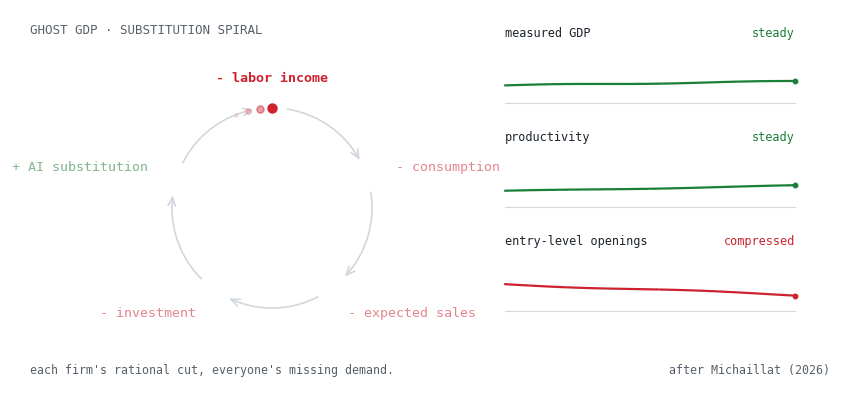

# AI-and-Employment

Why entry-level information work can keep disappearing even when the
economy is doing fine.

Working paper · May 2026 · not submitted for publication · sole author · written in Chinese

---

## The question

Everyone agrees AI makes information work faster. The disagreement is
about what that does to the people doing the work — and almost everyone on
both sides assumes that if the economy grows, employment recovers with it.

I don't think that follows, and this paper is my attempt to show why. You
can get the good macro outcome — higher productivity, cheaper output, a
growing economy — and still strand the people at the bottom of the ladder,
because the jobs AI creates are not *near* the jobs it replaces. A
displaced data-entry clerk and a model-governance analyst are not one
retraining course apart.

I wrote this because it bothered me. I spend a lot of my time building
tools that automate exactly the kind of entry-level information work this
paper is about. I wanted the honest version of that trade-off, not the
comfortable one.

## The mechanism

<picture>
  <source media="(prefers-color-scheme: dark)" srcset="assets/ghost-gdp-dark.gif">
  
</picture>

The argument runs in three steps:

1. **Micro — task substitution.** AI doesn't delete occupations; it
   deletes task bundles, and the deleted bundles cluster at the entry
   rung. Five occupations, five different exposures:

   | Occupation | Repetitive tasks | Cognitive tasks | Exposure |
   |---|---|---|---|
   | Programming | ~45% | ~75% | medium — the entry rung compresses |
   | Accounting & audit | ~50% | ~60% | medium |
   | Legal support | ~40% | ~55% | medium |
   | Customer service | ~70% | ~40% | high — headcount shrinks outright |
   | Data processing | ~85% | ~30% | high |

2. **Meso — matching friction.** New AI-adjacent tasks do get created
   (model governance, prompt design, output audit). But in manufacturing,
   a displaced machine operator could step sideways into maintenance —
   *within-domain* reinstatement. Here the new tasks are *cross-domain*:
   different skills, higher entry bar, fewer seats. Search-and-matching
   theory says exactly what follows — vacancies exist, matching fails,
   unemployment persists.

3. **Macro — the Ghost GDP spiral.** Each firm's substitution decision is
   individually rational and collectively self-defeating: labor income
   falls, consumption falls, expected sales fall, investment falls — so
   firms lean harder on AI to protect margins. Measured GDP and
   productivity can hold or rise through all of it. The loop turns; the
   dials read fine.

**The core claim: output growth and structural unemployment can coexist,
even in the optimistic scenario.** Judging AI by GDP alone will miss it.

## What this paper is not

Its own words, translated: *this is an integrative theory paper, not an
identified causal model. The occupational data supports the mechanism
judgments; it does not estimate a net employment effect.* The BLS wage
series and industry hiring signals it cites are consistent with the
mechanism — four of the five occupations lost real purchasing power
2018–2024 — but consistency is not identification.

## The paper

<details>
<summary><strong>English abstract</strong> (the paper is in Chinese)</summary>

> **Employment under Large-Scale AI Deployment: Why Structural
> Unemployment Can Persist Even in the Optimistic Scenario**
>
> This paper examines an apparent paradox: large-scale AI deployment can
> raise productivity while simultaneously generating persistent structural
> unemployment in entry-level information-processing work. Using an
> integrated framework running from micro-level task substitution, through
> meso-level matching frictions, to macro-level aggregate-demand feedback,
> it analyses five occupations — programming, accounting and audit, legal
> support, customer service, and data processing.
>
> The paper argues that the AI shock acts on the supply side and the
> demand side at once. Beyond the standard consumption channel, it
> completes the investment link in the transmission chain through the
> Keynesian accelerator effect and a Ghost GDP substitution spiral, in
> which each firm's individually rational decision to substitute AI for
> labour erodes the aggregate demand that all firms depend on, while
> measured output holds up. Drawing on search-and-matching theory, it then
> explains why the creation of new tasks does not automatically absorb
> displaced workers: in information-processing work, reinstatement is
> predominantly cross-domain rather than within-domain, so the new task
> bundles sit too far from the old ones for displaced entry-level workers
> to reach.
>
> The central claim is that output growth and structural unemployment can
> coexist even under optimistic assumptions, because cross-domain
> reinstatement is weak, matching frictions are strong, and task
> restructuring in highly repetitive roles tends to compress the entry
> rung of the career ladder. Assessing the economic consequences of AI
> therefore requires examining labour-market absorption capacity and
> career-ladder stability, not aggregate output alone.
>
> **Keywords:** artificial intelligence; structural unemployment; task
> model; search-and-matching; aggregate demand; information-processing
> occupations
>
> *Written in Chinese. This is the author's English abstract.*

</details>

**[Full text (Chinese, PDF) →](paper/ai-employment-working-paper-2026-05-zh.pdf)**

```
paper/    full text (Chinese, PDF)
assets/   figures
```

---

*One of four directions on [my profile](https://github.com/jerryxugit-2026) —
this one sits in the AI column on purpose: I build these tools, so I
should be the one counting what they cost.*
